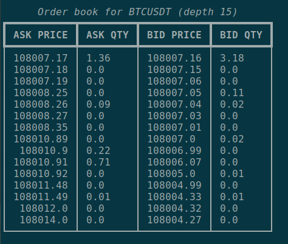

# $\color{MidnightBlue}\textit{\textbf{order-book-view}}$

 


Python app that visualizes Binance Order Book data.


#### What the app does:
 Internally, the app utilizes REST API to fetch Order Book data 
 from Binance service and displays it in a terminal


#### Command line arguments:
        
```
-h, --help              show this help message and exit
--symbol SYMBOL         instrument symbol (BTCUSDT,SOLUSDT,ETHUSDT,ETHBTC, ...)
                        (BTCUSDT by default)
--depth DEPTH           number of price levels (15 by default)
--precision PRECISION   floating point numbers precision (2 by default)
--timeout TIMEOUT       data update timeout (3s by default)

```
#### Samples of usage:

```
python order-book-view.py --symbol=SOLUSDT
python order-book-view.py --symbol=ETHUSDT --depth 20
python order-book-view.py --symbol=BTCUSDT --depth 15 --timeout 5
python order-book-view.py --symbol=BTCUSDT --depth 20 --precision 2
```

#### Screenshots:
-----------------
